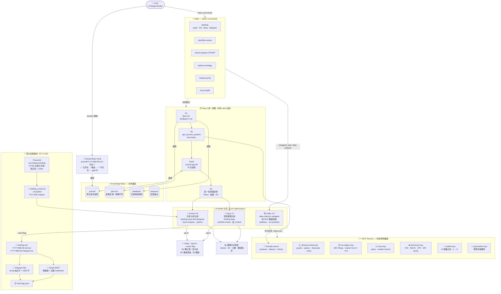

# Portfolio — Claude Code 投資研究與組合管理框架

一套建構在 **Claude Code skills + MCP servers** 之上的美股投資研究與組合管理工作區。把日報、組合檢視、個股深度分析、選擇權策略、交易日誌等流程，全部封裝成可重複執行的 slash command，並用一套**第一性原理紀律**（可驗證 thesis → 證偽條件 → 機率分布 + EV）約束每一個投資結論，避免淪為 narrative。

- **使用對象**：自行操作美股/選擇權、想用 LLM 輔助但要求紀律與可驗證性的個人投資人 / quant
- **輸出語言**：全繁體中文
- **券商整合**：透過 `firstrade-server` MCP 取即時持倉（以 Firstrade 為參考整合，可替換成你自己的券商 MCP）
- **資料來源**：7 個 MCP server（即時報價、SEC、技術指標、情緒/基本面、預測市場等）+ FRED 總經 + EODHD 基本面 REST 快取
- **可選自動化**：launchd 每個 NYSE 交易日定時產生並推送日報到 Telegram + Email

> ⚠️ **非投資建議。** 本專案是分析與紀律工具，所有輸出僅供研究參考；你需自行承擔所有交易決策與風險，並自備所有 API key / 券商憑證。詳見文末免責聲明。

> 📦 自寫的兩個 MCP server（`technical` 技術指標、`eodhd` 情緒）已獨立開源於 **[fadacai-mcp-servers](https://github.com/PatrickSUDO/fadacai-mcp-servers)**。

---

## 系統架構



---

## 快速開始

### 前置需求

- **[Claude Code](https://docs.claude.com/claude-code)** CLI（本框架的執行環境，skills / agents / MCP 都靠它）
- **Python 3.10+**（`tools/` 腳本與部分 MCP server）
- **[uv](https://github.com/astral-sh/uv)**（執行 Python MCP server，建議）
- macOS（`launchd` 自動推送為 macOS 專屬；其餘功能跨平台）

### 安裝

```bash
# 1. clone
git clone <this-repo-url> portfolio && cd portfolio

# 2. Python 依賴（tools/ 腳本用）
pip3 install -r tools/requirements.txt

# 3. 環境變數（自動推送 / 總經才需要；純互動分析可略過）
cp .env.example .env      # 再依註解填入你自己的 key

# 4. 啟動 Claude Code，輸入任一指令
claude
> /mcp-health             # 先確認 MCP 連線
> /briefing               # 跑第一份日報
```

### MCP servers 設定（核心）

本框架的數據來自 7 個 MCP server，需各自安裝並在 Claude Code 註冊（`claude mcp add ...` 或專案 `.mcp.json`）。**所有 API key / 券商憑證由你自備，本 repo 不含任何金鑰。**

| Server | 取得方式 | 需要 key？ |
|--------|----------|:---------:|
| `firstrade-server` | 第三方 [morristai/firstrade-mcp](https://github.com/morristai/firstrade-mcp) + 你自己的憑證 shim（**勿把券商帳密 commit 進任何 repo**） | ✅ 券商登入 |
| `yfinance-advanced` | PyPI 套件 [`yfinance-mcp`](https://pypi.org/project/yfinance-mcp/)，`uvx yfinance-mcp` 直接啟動，免 clone | ❌ |
| `sec-edgar-mcp` | PyPI 套件 [`sec-edgar-mcp`](https://pypi.org/project/sec-edgar-mcp/)，`uvx sec-edgar-mcp` 直接啟動，免 clone | ❌（需填 email 作 user-agent） |
| `fmp-mcp` | [Financial-Modeling-Prep-MCP-Server](https://github.com/imbenrabi/Financial-Modeling-Prep-MCP-Server)，**npm 無套件**，需 clone + build；建議放在 project 以外的獨立資料夾 | ✅ FMP token（free tier） |
| `technical-mcp` | 姊妹 repo [fadacai-mcp-servers `/technical`](https://github.com/PatrickSUDO/fadacai-mcp-servers/tree/main/technical) | ❌（用 yfinance） |
| `eodhd-mcp` | 姊妹 repo [fadacai-mcp-servers `/eodhd`](https://github.com/PatrickSUDO/fadacai-mcp-servers/tree/main/eodhd) | ✅ EODHD token |
| `polymarket-mcp` | PyPI 套件 [`polymarket-mcp`](https://pypi.org/project/polymarket-mcp/)，`uvx polymarket-mcp` 直接啟動，免 clone | ❌ |

**Claude Code 註冊指令（`/path/to/fadacai-mcp-servers` 替換成你自己的路徑）：**

```bash
# uvx 直接啟動（免 clone）
claude mcp add yfinance-advanced -- uvx yfinance-mcp
claude mcp add sec-edgar-mcp --env SEC_EDGAR_USER_AGENT="Your Name your@email.com" -- uvx sec-edgar-mcp
claude mcp add polymarket-mcp -- uvx polymarket-mcp

# fadacai-mcp-servers（clone 後 uv sync）
claude mcp add technical -- uv --directory /path/to/fadacai-mcp-servers/technical run server.py
claude mcp add eodhd-mcp --env EODHD_API_TOKEN=xxxx -- uv --directory /path/to/fadacai-mcp-servers/eodhd run server.py

# fmp-mcp（需 clone 到獨立資料夾，npm install && npm run build 後）
claude mcp add fmp-mcp --env FMP_API_KEY=xxxx -- node /path/to/fmp-mcp/dist/index.js
```

> 缺任一 server 不會讓整個框架失效——`/mcp-health` 會標出不可用者，skills 內建 retry → 健康檢查 → WebSearch fallback。

### 環境變數（`.env`）

| 變數 | 用途 | 取得 |
|------|------|------|
| `FRED_API_KEY` | 總經快照（Fed Funds / CPI / 殖利率曲線 / HY OAS / VIX） | [FRED 免費申請](https://fred.stlouisfed.org/docs/api/api_key.html) |
| `EODHD_API_TOKEN` | 基本面快取（`fetch_fundamentals.py`）：PE/PEG/分析師PT/盈餘 beat rate/季度成長 | [EODHD 申請](https://eodhd.com/financial-apis/)（All-In-One 含 Fundamentals）|
| `TELEGRAM_BOT_TOKEN` / `TELEGRAM_CHAT_ID` | 日報推送到 Telegram | `@BotFather` / `getUpdates` |
| `SMTP_*` / `EMAIL_*` | 日報 email 副本 | Gmail App Password |
| `BRIEFING_*` / `FRIDAY_CODEX` / `RETRY_MAX` 等 | launchd 自動推送行為 | 見 `.env.example` 註解 |

以上**全部選用**——不設也能用所有互動式 slash command，只是少了自動推送、總經快照與三錨點估值快取。

---

## 指令一覽

| 指令 | 用途 | 模型 | 預估時間 |
|------|------|------|---------|
| `/briefing` | 快速日報（技術面 + 警示 + 計畫進度） | Sonnet | ~1 min |
| `/briefing full` | + 情緒面 + 市場動態 + 預測市場 | Sonnet | ~3 min |
| `/briefing deep` | + SEC + FMP + 個股深度分析 | Opus | ~5 min |
| `/briefing telegram` | Telegram 推送格式（emoji 純文字，寫出 briefing-out/ 兩個檔案） | Sonnet | ~2-3 min |
| `/briefing telegram --send` | 同上，並實際推送至 Telegram + 寄送 email | Sonnet | ~2-3 min |
| `/portfolio-review` | 完整組合報告（板塊配置 + 個股分析） | Opus | ~3-5 min |
| `/stock-analysis TICKER` | 個股深度研究（支援多股比較） | Sonnet / Opus | ~2 min |
| `/options-strategy TICKER STRATEGY` | 選擇權策略計算（E_adj 排序） | Sonnet | ~1-2 min |
| `/todo` | 下一交易日 / 盤中 / 盤後優先行動清單 | Sonnet | ~1 min |
| `/ev-check [7d\|14d\|30d]` | 強制第一性機率分布 + 組合 EV 計算 | — | ~1 min |
| `/trade-journal log\|review\|summary\|auto` | 交易記錄與回顧 | — | ~1 min |
| `/mcp-health` | 測試所有 MCP server 連線狀態 | — | ~30 sec |

**`--send` 旗標：** 可加在任何 tier 後，執行完自動推送 Telegram + email。例：`/briefing full --send`

**`--codex` 旗標：** 任何分析 skill 後加，觸發 Codex 獨立第一性分析（B1）+ 機會掃描（B2）+ 輪動分析（B3）。`--codex-adversarial` 觸發壓力測試模式。

**模型切換：** 若 harness 未自動套用 frontmatter model，手動 `/model sonnet` 或 `/model opus` 後再執行 skill。Session context > 100k 時建議先 `/compact`。

---

## 使用範例

### 每日例行

```
/briefing                        ← 快速掃描（Sonnet，~1min）
/briefing full                   ← + 情緒面、預測市場
/briefing deep                   ← 完整版含 SEC + 個股分析（Opus）
/briefing telegram               ← 生成 Telegram 推送格式（寫出檔案，不發送）
/briefing telegram --send        ← 生成並推送至 Telegram + email
/briefing full --send --codex    ← 完整版 + Codex + 推送
```

### 個股研究

```
/stock-analysis PLTR
/stock-analysis ANET CRWD        ← 兩檔比較，依 EV 排序
/stock-analysis MU --codex       ← + Codex 獨立第二意見
```

### 選擇權分析

```
/options-strategy PLTR sell-put
/options-strategy PLTR AMD MU sell-put    ← 多標的 E_adj 比較
/options-strategy SSRM covered-call
/options-strategy MU leaps
```

### 交易記錄

```
/trade-journal auto              ← 自動偵測倉位變動
/trade-journal log               ← 手動記錄交易
/trade-journal review            ← 檢視計畫執行進度
/trade-journal summary           ← 月度損益摘要
```

### 手動重發 Briefing

```bash
python3 tools/send_briefing.py latest        # 重發最新一份
python3 tools/send_briefing.py 2026-05-12    # 重發特定日期
DRY_RUN=1 python3 tools/send_briefing.py latest   # Dry-run（不實際發送）
```

---

## Telegram 自動推送

每個 NYSE 交易日 **ET 11:30**（夏令 UTC 15:30 / 冬令 UTC 16:30，荷蘭時間恆為 17:30）自動推送盤中決策摘要。週五加 `--codex` 第二意見。

### Telegram 訊息格式

```
📊 5/12 盤中 13:00 ET

📰 News & Catalysts
  • ICHR: Q1 beat，Q2 guide $290-310M，GAAP EPS 轉正

📅 Earnings This Week
  • NVDA 5/20 AMC — HBM demand，data-center 指引

📊 Sentiment Pulse (EODHD 7d)
  📈 改善: ONTO 1.00, STRL 0.90, AVGO 0.90
  ⚠️ 注意: MU 急降 0.97→0.51

💰 估值 & Thesis
  📉 最低估: MU vs 公允價 −22%（三錨點中位 $375）
  📈 最高估: ARM vs 公允價 +38%
  📋 今日 thesis: AVBO:q2-guide → partial 公允價 $460→$415（−9.8%）

🔄 Sector Rotation
  💪 leading: 半導體 SMH (+34.9% vs SPY)
  📈 improving: 工業 XLI
  💀 lagging: 能源 XLE

🚨 Alerts
  • ICHR ⚠️ 財報 reaction window，技術訊號暫停

🎯 今日待辦
  • ICHR: 等 reaction settle 後評估加碼至 100 股

📋 明日待辦
  • 確認 5/20 cluster 倉位（QCOM/ON/ANET/NVDA）

⚡ Quick Take
  全面回調但 SMH 仍 leading，sentiment 全面正面。
  本週核心：ICHR reaction + 5/20 四檔財報前倉位確認。
```

### 快速設定

**Step 1 — Telegram Bot**

1. 開啟 Telegram → 搜尋 `@BotFather` → `/newbot`
2. 輸入 bot 名稱和 username，取得 `TELEGRAM_BOT_TOKEN`
3. 對你的 bot 傳一則訊息，然後在瀏覽器開啟：
   ```
   https://api.telegram.org/bot<YOUR_TOKEN>/getUpdates
   ```
4. 從回傳 JSON 找 `"chat": {"id": ...}` → 取得 `TELEGRAM_CHAT_ID`

**Step 2 — Gmail App Password**

1. Google 帳戶 → 安全性 → 兩步驟驗證（先開啟）→ 應用程式密碼
2. 選「其他（自訂名稱）」→ 輸入 `fadacai` → 產生 16 字元密碼

**Step 3 — 設定 `.env`**

```bash
cp .env.example .env
```

編輯 `.env`，填入以下欄位：

```bash
TELEGRAM_BOT_TOKEN=123456789:AAFxxxxxxxxxxxxxxxxxxxxxxxxxxxx
TELEGRAM_CHAT_ID=1234567890

SMTP_USER=your-email@gmail.com
SMTP_PASS="xxxx xxxx xxxx xxxx"    # Gmail App Password，務必加引號
EMAIL_FROM=your-email@gmail.com
EMAIL_TO=your-email@gmail.com
```

> ⚠️ `SMTP_PASS` 如果有空格**必須**加引號，否則 bash 會解析錯誤。

**Step 4 — 安裝 Python 依賴**

```bash
pip3 install -r tools/requirements.txt
```

**Step 5 — 安裝 launchd 排程（macOS）**

```bash
cp tools/launchd/com.fadacai.briefing.plist ~/Library/LaunchAgents/
# 修改 plist 中的路徑（如果專案目錄不同）
launchctl load ~/Library/LaunchAgents/com.fadacai.briefing.plist
launchctl list | grep fadacai    # 確認已載入（PID 欄顯示 -）
```

**Step 6 — macOS TCC 權限（必做）**

launchd 背景程序需要存取 `~/Desktop` 裡的腳本：

1. **System Settings** → **Privacy & Security** → **Full Disk Access**
2. 點 **+** → 按 `Shift+Cmd+G` → 輸入 `/bin` → 選 **bash** → Open
3. 確認開關為 **ON**

**Step 7 — 手動測試**

```bash
# 立刻觸發（不等 13:00）
launchctl start com.fadacai.briefing

# 觀察 log
tail -f ~/Desktop/fadacai-v2/portfolio/briefing-out/launchd.log

# 確認發送成功
tail -1 briefing-out/send-log.jsonl
# → {"date": "...", "telegram": "ok", "email": "ok"}
```

### 架構說明

```
launchd (每日 ET 11:30，NYSE 交易日)
    │
    ▼
~/.local/bin/fadacai_briefing_runner.sh   ← TCC-safe wrapper
    ├── check_trading_day.py              ← NYSE 休市日 exit 0
    ├── 週五 → CODEX_FLAG="--codex"
    ├── [non-fatal] fetch_macro.py        ← FRED 總經快取（TTL 36h）
    ├── [non-fatal] earnings_history.py   ← yfinance 盈餘快取（TTL 24h）
    ├── [non-fatal] fetch_fundamentals.py ← EODHD 基本面快取（TTL 24h）；含 A4 自建估值（CAGR→own_fwdEPS→own_target）
    ├── [non-fatal] fetch_news.py         ← EODHD 新聞全文快取（TTL 6h）；P3 訊號擷取的 body 來源
    └── claude -p "/briefing telegram --send $CODEX_FLAG"
            │
            ▼
        .claude/skills/briefing/SKILL.md (telegram tier)
            ├── Step 0.65: 讀 fundamentals cache（三錨點估值輸入）
            ├── T1: Earnings Window（from cache）
            ├── T2: Sentiment Pulse（EODHD sentiment_trend）
            ├── T2.5: 💰 估值 & Thesis Pulse（cache 算，signal-only）
            ├── T3: News & Catalysts
            ├── T4: Sector Rotation
            ├── T5-T7: Alerts / 待辦 / QuickTake
            ├── T8a: 寫 briefing-out/YYYY-MM-DD-full.md
            ├── T8b: 寫 briefing-out/YYYY-MM-DD-telegram.txt
            └── tools/send_briefing.py YYYY-MM-DD
                    ├── POST Telegram Bot API（> 4096 字自動切段）
                    ├── SMTP send email（精簡版 + 完整 markdown）
                    └── 寫 briefing-out/send-log.jsonl
```

### 輸出檔案

| 檔案 | 說明 |
|------|------|
| `briefing-out/YYYY-MM-DD-full.md` | 完整 briefing markdown（email 附件） |
| `briefing-out/YYYY-MM-DD-telegram.txt` | Telegram 純文字格式 |
| `briefing-out/send-log.jsonl` | 每次發送記錄（時間、狀態、dry_run） |
| `briefing-out/launchd.log` | launchd 排程執行 log |
| `briefing-out/launchd.err` | launchd 錯誤 log |

> `briefing-out/` 已加入 `.gitignore`（含個人帳戶數據，不 commit）。

### 常見問題排解

| 問題 | 排查 |
|------|------|
| `Operation not permitted` | FDA 未授予 `/bin/bash`（見 Step 6） |
| `SMTP_PASS: command not found` | App Password 有空格但沒加引號（`.env` 需加 `"`） |
| `Unknown command: /briefing` | runner 需 `cd $REPO_ROOT` 後才呼叫 claude（已內建） |
| Telegram 沒收到 | 確認 `TELEGRAM_CHAT_ID` 是你的個人 chat id，不是群組 id |
| `exchange_calendars not installed` | `pip3 install exchange_calendars`（有 fallback，非致命） |
| launchd.log 空白 | job 還在跑（claude 需要 2-5 分鐘），等待後再看 |

---

## MCP Servers

| Server | 功能 | 備註 |
|--------|------|------|
| **firstrade-server** | 即時持倉、帳戶餘額、交易歷史、報價 | 主要帳戶數據源 |
| **yfinance-advanced** | 即時報價、選擇權鏈、財報、新聞、分析師評級 | 主要市場數據源 |
| **sec-edgar-mcp** | SEC 財報、內部人 Form 4、8-K 事件、XBRL | 官方法規文件 |
| **fmp-mcp** | 同業比較、市場漲跌排行（Free tier） | 補充數據 |
| **technical-mcp** | RSI、MACD、布林通道、ATR、動量分數、S/R levels | 技術分析 |
| **eodhd-mcp** | **`get_news`**（新聞全文 body/symbols/tags，P3 訊號擷取用）+ AI 情緒分析 + **基本面快照**（PE/PEG/分析師PT/盈餘 beat rate/毛利率/季度成長，7 工具，ticker 格式: AAPL.US）| 情緒分析 + 免費版估值 + 新聞全文 |
| **polymarket-mcp** | 預測市場事件概率（Demo mode，read-only） | 市場信念數據 |

**MCP Retry Policy：** 失敗 → 重試 3 次 → 健康檢查 → fallback WebSearch/WebFetch，輸出中標記 `⚠️ [server] MCP 不可用`。

---

## 關鍵本地檔案

| 檔案 / 目錄 | 用途 | 更新方式 |
|------------|------|---------|
| `plan.md` | 投資計畫：板塊目標、策略佇列、觀察清單 | 手動（僅在用戶要求時） |
| `journal/` | 每日交易日誌（YYYY-MM-DD.md），含完整倉位快照 | 自動（Step 0c/0d + hook） |
| `feedback/` | 交易風格規則，所有 skill 每次必讀 | 手動（學習後更新） |
| `research/` | 個股投資論文（MU 記憶體週期、HDD AI 儲存等） | 手動 |
| `.env` | Telegram + SMTP 設定（**gitignored**，cp .env.example） | 手動 |
| `tools/` | Pipeline 腳本：`send_briefing.py`、`check_trading_day.py`、`briefing_runner.sh`、`fetch_macro.py`、`fetch_fundamentals.py`（EODHD 基本面 + A4 自建估值快取）、`fetch_news.py`（EODHD 新聞全文快取，TTL 6h）、`earnings_history.py`、`thesis_ledger.py`、`test_self_valuation.py`（A4 單元測試） | git tracked |
| `briefing-out/` | 每日 briefing 輸出 + 發送 log（**gitignored**） | 自動生成 |
| `briefing-out/cache/` | 預載快取：`macro-snapshot.json` / `earnings-history.json` / `earnings-dates.json` / `fundamentals-snapshot.json`（含 A4 `self_valuation`，TTL 24h）/ `news-articles.json`（全文 600-char excerpts，TTL 6h）— **日報 zero-latency 數據層** | 自動（runner + launchd） |
| `docs/briefing-auto-send.md` | Telegram 設定完整教學 | git tracked |
| `CLAUDE.md` | 完整專案指令手冊（Step 0 規範、MCP 政策、模型分工） | 手動 |

---

## 常見問題

**MCP 掛了怎麼辦？**
執行 `/mcp-health` 診斷，通常重開 Claude Code session 即可。三次重試後自動 fallback WebSearch。

**倉位資料從哪來？**
`mcp__firstrade-server__get_account_position` 取即時數據（Step 0b 自動執行）。

**交易記錄在哪？**
`journal/` 目錄，每日一檔（YYYY-MM-DD.md），每次 skill 執行都會建立或更新。

**配置計畫在哪？**
`plan.md` — 含板塊目標（%）、策略佇列（⏳/✅/🔄）、觀察清單、策略原則。

**第一性原理紀律是什麼？**
每個 Verdict / Recommendation 前強制填寫：核心 thesis（可驗證命題）+ 證偽條件（2-3 個 falsifiable 觀察點）+ 機率分布（EV 計算）。確保結論有 ground truth 依據，不是 narrative。

**Telegram 每天幾點收到？**
美東 ET 11:30（NYSE 交易日），對應荷蘭時間夏令 17:30 / 冬令 17:30（自動 DST-aware）。

---

## 方法論亮點

這套框架的核心不是「叫 LLM 給意見」，而是用多層紀律強迫每個結論落在可驗證的 ground truth 上：

- **第一性原理紀律（Step 0e）** — 任何 Verdict 前強制回答三題：① 核心 thesis（1 句**可驗證命題**，非 narrative）② 證偽條件（2-3 個 falsifiable 觀察點）③ 機率分布 + EV（由 `probability-honesty-checker` agent 強制計算，禁用 default bell shape 與「略偏正」這類質性語言）。
- **三錨點 Fair PE 估值（Section 8.5 / G3.5）** — 不手寫 PE 倍數猜想；用三個獨立錨點做三角定位：A1 市場隱含 PE（EODHD）/ A2 PEG 成長合理倍數 / A3 分析師 PT 隱含 PE。Base = median；Bull = max × 1.25；Bear = min × 0.70。`pe_ratio == 0.0` / `peg_ratio == 0.0` → 自動丟棄該錨，標 `(anchor unavailable)`。
- **Thesis Ledger（`tools/thesis_ledger.py`）** — 把帶觸發點的 thesis 登錄進帳本，到期（如財報日）自動回頭抓實際數字驗收 passed/failed，累積命中率。詳見 [`docs/thesis-ledger.md`](docs/thesis-ledger.md)。
- **Thesis 驗證 → 股價影響（D2 三桶分解）** — thesis verdict 不只是分類；`resolve` 時帶結構化旗標：`fair_value_before/after`（三錨點重算）+ `price_impact_pct` + `impact_decomp`（thesis 成分 vs 倍數重估成分分解）。實例：AVBO partial → `thesis +6%(FY27 AI guide 確認)/multiple −16%(GM 壓縮 re-rate)=net −9.8%`。
- **全持倉基本面快取（`briefing-out/cache/fundamentals-snapshot.json`）** — `fetch_fundamentals.py` 每交易日 launchd 預載，TTL 24h。Quick/Telegram tier 直接讀快取（zero-latency，不等 MCP）；Deep tier 強制刷新。
- **A4 自建估值錨（sanity / divergence flag）** — `fetch_fundamentals.py` 同次 API call 計算：`own_fwdEPS = 歷史 CAGR (幾何，40% cap → fade 向 8% terminal) × 淨利率 ÷ 股數`（完全不看分析師 estimate）。`own_target_price = own_fwdEPS × base_FairPE(median A1,A2,A3)`。`A4vsA3% = (own_target − wall_street_target) / wall_street_target` 乾淨隔離「我的盈利觀 vs Street 盈利觀」（倍數固定）。**A4 不進 EV**，僅做分歧 flag：`confidence=unavailable`（虧損股 / <3年資料）→ `(self-val N/A)`；`low`（營收 stdev>30%）→ `⚠️低信心`；`ok` → 正常顯示。34 單元測試（`test_self_valuation.py`）覆蓋 CAGR、cap、decel、macro clamp、guardrails。
- **新聞全文快取 + P3 訊號擷取（`briefing-out/cache/news-articles.json`）** — `fetch_news.py` TTL 6h，top 8 篇/ticker，600-char body excerpt。`mcp__eodhd-mcp__get_news` 工具提供即時全文（1500 char）。Deep tier §9.5 / stock-analysis Step 4b 從 news body + SEC 8-K + 財報逐字稿抽**已量化陳述**（wafer starts / capex / ASP 等），強制附 raw_quote（≤120 字逐字引用），signal → thesis 轉換後以 `--source signal-inference` 登錄 thesis_ledger，閉環追蹤 P3 命中率。反幻覺鎖：**無 raw_quote = 無 signal = 不登錄。**

## 如何擴展

- **新增 skill**：在 `.claude/skills/<name>/SKILL.md` 建立，frontmatter 設 `user_invocable: true` + `description`，內文遵循 `CLAUDE.md` 的 Step 0 統一規範。
- **新增資料 agent**：純抓資料的子代理用 `data-collector`（Haiku）；需要紀律推理的用既有 pattern。
- **新增工具**：放 `tools/`，純標準函式庫優先（如 `thesis_ledger.py` 即零相依），方便他人免裝依賴執行。
- **調整交易風格**：`feedback/*.md`（本機個人檔，已 gitignored）每次 skill 必讀，是把你的偏好餵給框架的地方。

完整規範與設計細節見 [`CLAUDE.md`](CLAUDE.md)。

## 授權

[MIT License](LICENSE) — 自由使用、修改、商用，保留版權聲明即可。

## 免責聲明

本專案為**投資研究與紀律輔助工具**，所有輸出（含 Verdict、EV、機率、選擇權建議）**僅供研究與教育參考，不構成投資建議、要約或保證**。美股與選擇權交易具高度風險，可能導致本金全部損失。你需自行評估並承擔一切交易決策與後果，並自備所有 API key 與券商憑證；作者與貢獻者不對任何使用本專案所致之損失負責。
