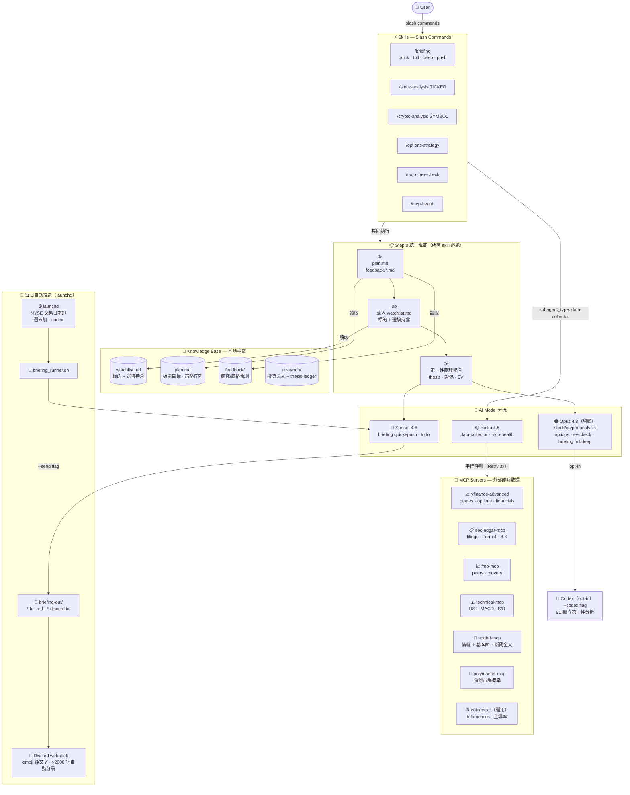

<div align="right">

[**English**](README.md) · 繁體中文

</div>

# Alpha Desk — Claude Code 投資研究工作區（美股 + 加密）

一套建構在 **Claude Code skills + MCP servers** 之上的投資研究工作區，涵蓋**美股 / 選擇權與加密貨幣**。把日報、個股深度分析、加密分析、選擇權策略、EV 檢查等流程封裝成可重複執行的 slash command，並用一套**第一性原理紀律**（可驗證 thesis → 證偽條件 → 機率分布 + EV）約束每一個投資結論，避免淪為 narrative。

- **使用對象**：自行研究美股 / 選擇權 / 加密、想用 LLM 輔助但要求紀律與可驗證性的個人投資人 / quant
- **輸出語言**：**預設英文**；在任何 skill 後加 `--cn` 旗標即切換為全繁體中文輸出
- **資料模型**：**watchlist-driven** — 手動維護的 `watchlist.md`（追蹤標的 + 選填持倉）是所有 skills 的真實來源，**無券商整合**
- **資料來源**：MCP servers（即時報價、SEC、技術指標、情緒/基本面、預測市場、CoinGecko 等）+ FRED 總經 + EODHD 基本面 REST 快取
- **可選自動化**：launchd 每個 NYSE 交易日定時產生並推送日報到 **Discord**（webhook）

> ⚠️ **非投資建議。** 本專案是分析與紀律工具，所有輸出僅供研究參考；你需自行承擔所有交易決策與風險，並自備所有 API key。詳見文末免責聲明。

> 🙏 **致謝 / 衍生說明**：本工作區衍生並客製自 [PatrickSUDO/fadacai-portfolio](https://github.com/PatrickSUDO/fadacai-portfolio)（MIT）。原作的兩個自寫 MCP server（`technical` 技術指標、`eodhd` 情緒/基本面）開源於 [fadacai-mcp-servers](https://github.com/PatrickSUDO/fadacai-mcp-servers)。

---

## 與上游的主要差異

| 面向 | 上游 fadacai-portfolio | 本工作區 alpha-desk |
|------|------------------------|---------------------|
| 標的來源 | `firstrade-server` MCP 即時持倉 | 手動 `watchlist.md`（無券商） |
| 倉位/日誌 | `journal/` 自動倉位快照 | 移除；watchlist 即唯一狀態 |
| 推送 | Telegram + Gmail SMTP | **Discord webhook** |
| 資產類別 | 美股 / 選擇權 | 美股 / 選擇權 **+ 加密貨幣** |
| 輸出語言 | 全繁體中文 | **預設英文 + `--cn` 切換繁中** |
| 移除的 skill | — | `/portfolio-review`、`/trade-journal` |
| 新增的 skill | — | `/crypto-analysis` |

---

## 系統架構



---

## watchlist.md — 真實來源

所有 skills 都從 `watchlist.md` 取得「要分析什麼」。它是一份手動維護的 markdown，分股票與加密兩段：

```markdown
## 股票 / 選擇權標的
| Ticker | Thesis 標籤 | Shares | Avg Cost | 備註 |
|--------|------------|--------|----------|------|
| NVDA   | 資料中心 AI 算力，毛利 70%+ | 100 | 120.50 | 信念持倉 |
| AVGO   | 客製化 ASIC + 軟體現金流 |      |          | 純追蹤 |

## 加密貨幣
| Symbol | Thesis 標籤 | Qty | Avg Cost | 備註 |
|--------|------------|-----|----------|------|
| BTC    | 固定供給 + ETF 淨流入 | 0.5 | 60000 | 核心 |
```

- **持倉欄位（Shares / Avg Cost / Qty）是選填的**：有填 → skills 算組合權重、集中度、未實現損益；留空 → 只做標的層級研究（估值 / 技術 / catalyst）。
- 複製 `watchlist.example.md` → `watchlist.md` 開始。`watchlist.md` 已 gitignored（不會 commit 你的持倉）。

---

## 快速開始

### 前置需求
- **[Claude Code](https://docs.claude.com/claude-code)** CLI
- **Python 3.10+**、**[uv](https://github.com/astral-sh/uv)**（執行 Python MCP server，建議）
- macOS（`launchd` 自動推送為 macOS 專屬；其餘跨平台）

### 安裝
```bash
# 1. clone
git clone <this-repo-url> alpha-desk && cd alpha-desk

# 2. Python 依賴
pip3 install -r tools/requirements.txt

# 3. watchlist
cp watchlist.example.md watchlist.md   # 填入你的標的

# 4.（選用）自動推送 / 總經 / 加密快取的環境變數
cp .env.example .env                    # 依註解填 key

# 5. 啟動
claude
> /mcp-health        # 先確認 MCP 連線
> /briefing          # 跑第一份日報（預設英文輸出）
> /briefing --cn     # 想要繁中輸出就加 --cn
```

### MCP servers
| Server | 取得 | 需 key？ |
|--------|------|:-------:|
| `yfinance-advanced` | `uvx yfinance-mcp`（免 clone；亦報價 `BTC-USD`） | ❌ |
| `sec-edgar-mcp` | `uvx sec-edgar-mcp`（填 email 作 user-agent） | ❌ |
| `fmp-mcp` | [Financial-Modeling-Prep-MCP-Server](https://github.com/imbenrabi/Financial-Modeling-Prep-MCP-Server)（clone + build） | ✅ free tier |
| `technical-mcp` | [fadacai-mcp-servers `/technical`](https://github.com/PatrickSUDO/fadacai-mcp-servers/tree/main/technical) | ❌ |
| `eodhd-mcp` | [fadacai-mcp-servers `/eodhd`](https://github.com/PatrickSUDO/fadacai-mcp-servers/tree/main/eodhd) | ✅ EODHD token |
| `polymarket-mcp` | `uvx polymarket-mcp` | ❌ |
| `coingecko` *(選用)* | `npx -y @coingecko/coingecko-mcp`（官方 npm，需 Node；demo 端點免 key）。註：`tools/fetch_crypto.py` 已直接抓 CoinGecko REST，此 MCP 完全選用 | 選用 |

> 缺任一 server 不會讓框架失效——`/mcp-health` 標出不可用者，skills 內建 retry → 健康檢查 → WebSearch fallback。`coingecko` 未配置時 `/crypto-analysis` 自動 fallback 到 yfinance（`BTC-USD`）+ WebSearch。

### 環境變數（`.env`，全部選用）
| 變數 | 用途 | 取得 |
|------|------|------|
| `DISCORD_WEBHOOK_URL` | 日報推送到 Discord | 頻道 → Integrations → Webhooks → New Webhook |
| `FRED_API_KEY` | 總經快照（Fed Funds / 殖利率曲線 / HY OAS / VIX） | [FRED 免費申請](https://fred.stlouisfed.org/docs/api/api_key.html) |
| `EODHD_API_TOKEN` | 基本面 + 新聞快取（`fetch_fundamentals.py` / `fetch_news.py`） | [EODHD](https://eodhd.com/financial-apis/) |
| `COINGECKO_API_KEY` | 提高 CoinGecko rate limit（demo plan 免費；不設也可用） | [CoinGecko API](https://www.coingecko.com/en/api) |
| `BRIEFING_*` / `FRIDAY_CODEX` / `RETRY_MAX` | launchd 自動推送行為 | 見 `.env.example` |

---

## 指令一覽

| 指令 | 用途 | 模型 | 預估時間 |
|------|------|------|---------|
| `/briefing` | 快速日報（技術面 + 警示 + 計畫進度） | Sonnet | ~1 min |
| `/briefing full` | + 情緒面 + 市場動態 + 預測市場 | Opus | ~3 min |
| `/briefing deep` | + SEC + 個股深度分析 | Opus | ~5 min |
| `/briefing push` | Discord 推送格式（emoji 純文字，寫出 briefing-out/ 兩檔） | Sonnet | ~2-3 min |
| `/briefing push --send` | 同上，並實際推送至 Discord | Sonnet | ~2-3 min |
| `/stock-analysis TICKER` | 個股深度研究（支援多股比較；`--current` 整合 watchlist） | Opus | ~2 min |
| `/crypto-analysis SYMBOL` | 加密深度研究（tokenomics / 供給 / 鏈上 / 主導率） | Opus | ~2-3 min |
| `/options-strategy TICKER STRATEGY` | 選擇權策略計算（E_adj 排序） | Opus | ~1-2 min |
| `/todo` | 下一交易日 / 盤中 / 盤後優先行動清單 | Sonnet | ~1 min |
| `/ev-check [7d\|14d\|30d]` | 強制第一性機率分布 + watchlist EV 計算 | Opus | ~1 min |
| `/mcp-health` | 測試所有 MCP server 連線狀態 | Haiku | ~30 sec |

**`--cn` 旗標：** 加在任何 skill 後，將該次輸出切換為**全繁體中文**（預設為英文）。例：`/stock-analysis NVDA --cn`
**`--send` 旗標：** 可加在任何 tier 後，執行完自動推送 Discord。例：`/briefing full --send`
**`--codex` 旗標：** 任何分析 skill 後加，觸發 Codex 獨立第一性分析（B1）。`--codex-adversarial` 觸發壓力測試模式。
**模型切換：** 若 harness 未自動套用 frontmatter model，手動 `/model sonnet` 或 `/model opus`。Session > 100k 先 `/compact`。

---

## 使用範例

```
# 每日例行
/briefing                        ← 快速掃描（Sonnet，~1min，英文）
/briefing --cn                   ← 同上但繁中輸出
/briefing deep                   ← 完整版含 SEC + 個股分析（Opus）
/briefing push --send            ← 生成並推送至 Discord
/briefing full --send --codex    ← 完整版 + Codex + 推送

# 個股 / 加密研究
/stock-analysis PLTR
/stock-analysis ANET CRWD        ← 兩檔比較，依 EV 排序
/crypto-analysis BTC             ← 加密第一性分析
/crypto-analysis BTC ETH         ← 兩幣比較
/crypto-analysis SOL --codex     ← + Codex 獨立第二意見

# 選擇權
/options-strategy PLTR sell-put
/options-strategy MU leaps

# 手動重發 Briefing
python3 tools/send_briefing.py latest          # 重發最新一份
DRY_RUN=1 python3 tools/send_briefing.py latest # Dry-run（不實際發送）
```

---

## Discord 自動推送

每個 NYSE 交易日定時（系統本地 17:00 CET/CEST）推送盤中決策摘要到 Discord 頻道。週五加 `--codex` 第二意見。完整設定見 [`docs/briefing-auto-send.md`](docs/briefing-auto-send.md)。

**快速設定：**
1. Discord 頻道 → ⚙ Edit Channel → Integrations → Webhooks → New Webhook → Copy URL
2. `.env` 填 `DISCORD_WEBHOOK_URL=...`（一個 webhook 即可，無需 bot token）
3. `cp tools/launchd/com.fadacai.briefing.plist ~/Library/LaunchAgents/`，改路徑後 `launchctl load`

**管線：**
```
launchd → briefing_runner.sh
    ├── check_trading_day.py        ← NYSE 休市日跳過
    ├── 週五 → --codex
    ├── [non-fatal] fetch_macro.py / earnings_history.py / fetch_fundamentals.py
    ├── [non-fatal] fetch_news.py / fetch_crypto.py
    └── claude -p "/briefing push --send $CODEX_FLAG"
            └── send_briefing.py → Discord webhook（>2000 字自動分段）+ send-log.jsonl
```

**輸出檔案：** `briefing-out/YYYY-MM-DD-full.md`、`-discord.txt`、`send-log.jsonl`、`launchd.log/.err`（整個 `briefing-out/` 已 gitignored）。

---

## MCP Retry Policy
失敗 → 重試 3 次 → 健康檢查 → fallback WebSearch/WebFetch，輸出中標記 `⚠️ [server] MCP 不可用`。

## 關鍵本地檔案
| 檔案 / 目錄 | 用途 | 更新方式 |
|------------|------|---------|
| `watchlist.md` | **真實來源**：追蹤標的 + 選填持倉（**gitignored**；範本 `watchlist.example.md`） | 手動 |
| `plan.md` | 投資計畫：板塊目標、策略佇列、觀察清單 | 手動 |
| `feedback/` | 研究 / 風格規則，所有 skill 每次必讀 | 手動 |
| `research/` | 投資論文 + `thesis-ledger.json`（thesis 追蹤帳本） | 手動 / 工具 |
| `.env` | Discord webhook + API key（**gitignored**，cp .env.example） | 手動 |
| `tools/` | Pipeline 腳本：`send_briefing.py`、`briefing_runner.sh`、`fetch_macro.py`、`fetch_fundamentals.py`、`fetch_news.py`、`fetch_crypto.py`、`earnings_history.py`、`watchlist_tickers.py`、`thesis_ledger.py`、`generate_html.py` | git tracked |
| `briefing-out/cache/` | 預載快取：macro / earnings / fundamentals / news / crypto — 日報 zero-latency 數據層 | 自動（runner + launchd） |
| `CLAUDE.md` | 完整專案指令手冊（Step 0 規範、MCP 政策、模型分工） | 手動 |

---

## 方法論亮點

這套框架的核心不是「叫 LLM 給意見」，而是用多層紀律強迫每個結論落在可驗證的 ground truth 上：

- **第一性原理紀律（Step 0e）** — 任何 Verdict 前強制回答三題：① 核心 thesis（1 句**可驗證命題**，非 narrative）② 證偽條件（2-3 個 falsifiable 觀察點）③ 機率分布 + EV（由 `probability-honesty-checker` agent 強制計算，禁用 default bell shape 與「略偏正」這類質性語言）。**asset-agnostic** — 股票與加密共用同一套紀律。
- **三錨點 Fair PE 估值（股票）** — 不手寫 PE 倍數猜想；用三個獨立錨點三角定位：A1 市場隱含 PE / A2 PEG 成長合理倍數 / A3 分析師 PT 隱含 PE。Base = median；Bull = max × 1.25；Bear = min × 0.70。
- **加密原生估值（`/crypto-analysis`）** — 加密無盈餘無 PE，改用：供給排程 / tokenomics（流通 vs 最大供給、發行率）、市場結構（BTC 主導率、總市值）、網路使用（TVL / 活躍地址 / 手續費）、資金流（ETF / 穩定幣）、週期帶。三條框定錨 → 由機率分布合成 EV。
- **Thesis Ledger（`tools/thesis_ledger.py`）** — 把帶觸發點的 thesis 登錄進帳本，到期（如財報日 / ETF 決議）自動回頭抓實際數字驗收 passed/failed，累積命中率。詳見 [`docs/thesis-ledger.md`](docs/thesis-ledger.md)。
- **A4 自建估值錨（股票，sanity / divergence flag）** — `fetch_fundamentals.py` 同次 API call 計算 `own_fwdEPS`（歷史 CAGR × 淨利率 ÷ 股數，完全不看分析師 estimate），隔離「我的盈利觀 vs Street 盈利觀」。不進 EV，僅做分歧 flag。
- **新聞全文 + P3 訊號擷取** — `fetch_news.py` 快取新聞 body，Deep tier / stock-analysis 從 body + SEC 8-K + 逐字稿抽**已量化陳述**，強制附 raw_quote（≤120 字逐字）。反幻覺鎖：**無 raw_quote = 無 signal = 不登錄。**

## 如何擴展
- **新增 skill**：在 `.claude/skills/<name>/SKILL.md` 建立，frontmatter 設 `user_invocable: true` + `description`，內文遵循 `CLAUDE.md` 的 Step 0 統一規範。Codex 第二意見路徑需在 `.agents/skills/<name>/SKILL.md` 放對應鏡像。
- **新增資料 agent**：純抓資料的子代理用 `data-collector`（Haiku）。
- **新增工具**：放 `tools/`，純標準函式庫優先（如 `thesis_ledger.py`、`watchlist_tickers.py` 即零相依）。
- **調整研究風格**：`feedback/*.md`（本機個人檔，已 gitignored）每次 skill 必讀。

---

## 授權與衍生說明

本專案以 **MIT License** 釋出（見 [`LICENSE`](LICENSE)）。

本工作區是 [PatrickSUDO/fadacai-portfolio](https://github.com/PatrickSUDO/fadacai-portfolio)（MIT, Copyright © 2026 fadacai）的衍生作品，已大幅客製：移除券商整合與組合管理、改為 watchlist-driven、推送改 Discord、新增加密貨幣研究、輸出語言改英文預設。原始 MIT 著作權聲明保留於 `LICENSE`。

## 免責聲明

本專案為**個人投資研究與紀律工具**，所有輸出僅供研究參考，**不構成投資建議、要約或招攬**。投資涉及風險，你需自行承擔所有交易決策與後果。作者與貢獻者不對任何因使用本工具產生的損失負責。你需自備並妥善保管所有 API key 與憑證；本 repo 不含任何金鑰。
